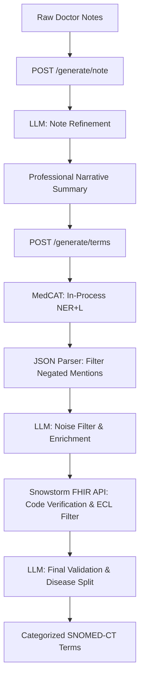

# 🚀 Clinical Notes Enhancer API

This directory contains the **FastAPI middleware service**. It bridges clinical text inputs with LLM refinement (any OpenAI-compatible chat completions endpoint), Named Entity Recognition run in-process via [MedCAT](https://github.com/CogStack/cogstack-nlp/), and concept validation against a local SNOMED-CT database (Snowstorm).

---

## 🏗️ System Architecture & Data Flow

The API coordinates a multi-stage pipeline to process unstructured clinical text into high-fidelity, categorized SNOMED-CT terms:



### Pipeline Details:
1. **Clinical Note Refinement (`/generate/note`)**: Translates shorthand clinical notes and abbreviations (e.g., `DM` ➔ `Diabetes Mellitus`, `HPT` ➔ `Hypertension`, `od` ➔ `once daily`) into a formal clinical narrative summary.
2. **Named Entity Recognition (NER)**: Runs the refined narrative through an in-process MedCAT model (loaded once per worker, on first use) to extract medical concepts (medications, procedures, symptoms, anatomical sites, diagnoses).
3. **Filtering & Enrichment**: The configured LLM filters out irrelevant mapping tags and enriches the results with any missing terms implied by the context.
4. **SNOMED-CT Concept Mapping**: Query terms are checked against the Snowstorm Lite FHIR expansion API (`/fhir/ValueSet/$expand`) using Expression Constraint Language (ECL) scopes to extract accurate codes and descriptions.
5. **Final Validation & Disease Split**: Categorizes diagnoses into `communicable_disease` and `non_communicable_disease`, discarding any contextually invalid mappings.

---

## ⚙️ Environment Variables & Configuration

Create a `.env` file in the project root directory (referenced by the API container) with the following environment variables:

| Variable | Description | Example / Default Value |
| :--- | :--- | :--- |
| `OPENAI_API_BASE` | Base URL of an OpenAI-compatible chat completions API | `https://<provider>/compatible-mode/v1` |
| `OPENAI_API_KEY` | API key for that endpoint | `sk-...` |
| `OPENAI_MODEL_ID` | Model name to request from that endpoint | `qwen3.8-flash` |
| `API_BEARER_TOKEN` | Raw authentication token string (used by client/tests) | `c73e3c54-b81b-45e9-ae05-8437e7ea3f2e` |
| `API_BEARER_TOKEN_HASH` | Bcrypt hash of the bearer token for security verification | `$2a$12$hknEgVoR.cfg.115lfneS...` |
| `SNOWSTORM_URL` | Base URL of the Snowstorm FHIR terminology server | `http://snowstorm-lite:8080` (or `http://localhost:8080`) |
| `SNOWSTORM_BRANCH` | Target branch of the SNOMED database | `MAIN` |
| `MEDCAT_MODEL_PACK_PATH` | In-container path to the MedCAT model pack (volume-mounted, see Step 2 below) | `/models/model_pack` |

> [!NOTE]
> The MedCAT model pack is a UMLS/SNOMED CT concept database + vocab, obtained
> via a [UTS](https://uts.nlm.nih.gov/) (UMLS license) account. It's too large
> and license-gated to bake into the Docker image, so it's downloaded once to
> the host and mounted read-only into the container instead (see `api/start.sh`
> and `MEDCAT_MODEL_PACK_HOST_PATH`).

---

## 🔒 Bearer Token Authentication & Hashing

For production deployments, the API secures all endpoints via a Bearer token verification check. You must generate a bcrypt hash of your chosen token and store it in `API_BEARER_TOKEN_HASH`. 

> [!NOTE]
> If `API_BEARER_TOKEN_HASH` is left empty or omitted, authentication checks will be skipped (only recommended for local debugging).

Use the following Python script to generate your token hash:

```python
import bcrypt

# The raw token clients must supply in the 'Authorization: Bearer <token>' header
raw_token = "my-secure-api-token"

# Generate bcrypt hash
hashed = bcrypt.hashpw(raw_token.encode('utf-8'), bcrypt.gensalt(rounds=12))
print("API_BEARER_TOKEN_HASH=" + hashed.decode('utf-8'))
```

---

## 🐳 End-to-End Container Deployment

To run the complete pipeline, all services must share the same Docker network (`backend`).
The fastest path is `./build.sh` from the repository root, which does everything
below (network, Snowstorm, API, GUI) in one command — the steps are broken out
here for manual/partial deployment.

### Step 1: Create the Docker Network
```bash
docker network create backend
```

### Step 2: Obtain a MedCAT Model Pack
Sign in at `https://medcat.sites.er.kcl.ac.uk/auth-callback-api` with your
UMLS/UTS API key, complete the model-pack request form, and download a
MedCAT SNOMED CT model pack. `CAT.load_model_pack()` accepts either a `.zip`
or an already-unpacked directory - place whichever you got at
`<repo>/medcat_models/model_pack` (the default `api/start.sh` looks for), or
set `MEDCAT_MODEL_PACK_HOST_PATH` to point elsewhere. It's mounted into the
API container read-only at container start; it is not baked into the image.

### Step 3: Run Snowstorm Lite & Onboard SNOMED-CT Dictionary
Snowstorm Lite is a lightweight, high-performance FHIR terminology server that runs self-contained (using Lucene) and does not require an external database like Elasticsearch. It has a very small memory footprint (typically under 1GB).

**1. Run Snowstorm Lite Container**
Run the container on the shared `backend` network, mapping port `8080`:
```bash
docker run -d \
  --name snowstorm-lite \
  --network backend \
  -p 8080:8080 \
  --restart unless-stopped \
  snomedinternational/snowstorm-lite:latest
```

**2. Onboard the SNOMED-CT RF2 Dictionary**
By default, the new Snowstorm Lite instance is empty. You must onboard your SNOMED-CT RF2 release archive (ZIP format) using the provided Python script:
```bash
# Run from the repository root
python scripts/snomed/snomed_rf_refresh.py \
  --archive-path /path/to/SnomedCT_RF2Release_INT_PRODUCTION.zip \
  --base-url http://localhost:8080
```
This script handles the onboarding process by:
1. Creating an import job via Snowstorm Lite's `POST /imports` endpoint.
2. Uploading the RF2 ZIP archive.
3. Polling the import status until it reports `COMPLETED`.

### Step 4: Deploy the FastAPI Middleware API
You can build and deploy the API using the helper script `api/start.sh`
(also invoked automatically by the root `build.sh`):
```bash
chmod +x api/start.sh
./api/start.sh
```

Alternatively, run the manual Docker commands:
```bash
# Build the API image
docker build -t cne-api .

# Run the API container
docker run -d \
  --name cne-api-container \
  --network backend \
  -p 8082:8082 \
  --env-file ../.env \
  -v "<repo>/medcat_models/model_pack:/models/model_pack:ro" \
  --restart unless-stopped \
  cne-api
```

---

## 📡 API Endpoints

### 1. Root & Health Checks

#### `GET /`
Verifies API connectivity. Requires bearer token if configured.
* **Response**: `{"message": "Clinical Notes Enhancer API"}`

#### `GET /health`
Internal service health status.
* **Response**: `{"status": "healthy"}`

#### `GET /generate/medcat/health`
Runs a test narrative through the in-process MedCAT model and parses the output to confirm the full pipeline is functional.
* **Response**:
  ```json
  {
    "status": "alive",
    "alive": true,
    "total_terms": 12,
    "terms": { ... },
    "tokens_used": { ... }
  }
  ```

---

### 2. Clinical Processing

#### `POST /generate/note`
Accepts raw doctor's notes and returns a refined, grammatically correct narrative paragraphs.
* **Request Body**:
  ```json
  {
    "text": "DM HPT currently: t losartan 100mg od t metformin 1g bd no active complaints"
  }
  ```
* **Response Body**:
  ```json
  {
    "text": "The patient has diabetes mellitus and hypertension. Currently, the patient is on Losartan 100mg once daily and Metformin 1g twice daily. The patient has no active complaints.",
    "tokens_used": {
      "generate_summary": { "input_token": 120, "output_token": 45 }
    }
  }
  ```

#### `POST /generate/terms`
The full processing pipeline: takes text, runs MedCAT, performs LLM filtering/enrichment, validates SNOMED-CT codes, and splits diagnoses.
* **Request Body**:
  ```json
  {
    "text": "The patient has diabetes mellitus and hypertension. Currently, the patient is on Losartan 100mg once daily and Metformin 1g twice daily."
  }
  ```
* **Response Body**:
  ```json
  {
    "terms": {
      "anatomical_sites": [],
      "procedures": [],
      "symptoms": [],
      "diagnosis": {
        "communicable_disease": [],
        "non_communicable_disease": [
          { "term": "Diabetes mellitus (disorder)", "code": "73211009" },
          { "term": "Hypertension (disorder)", "code": "38341003" }
        ]
      },
      "medications": [
        { "term": "Losartan (substance)", "code": "372687004" },
        { "term": "Metformin (substance)", "code": "372605001" }
      ]
    },
    "tokens_used": {
      "filter_tags": { "input_token": 450, "output_token": 180 },
      "validate_final_output": { "input_token": 310, "output_token": 95 }
    }
  }
  ```

---

## 🧪 Testing the API

A test suite is available under the `test/` directory to verify the health, auth, note-refinement, and term-generation endpoints.

1. Install testing dependencies:
   ```bash
   pip install requests python-dotenv
   ```
2. Navigate to the `test/` directory:
   ```bash
   cd test
   ```
3. Run tests using environment variables:
   ```bash
   API_BASE_URL=http://localhost:8082 API_BEARER_TOKEN=your-token-here python test_api.py
   ```
