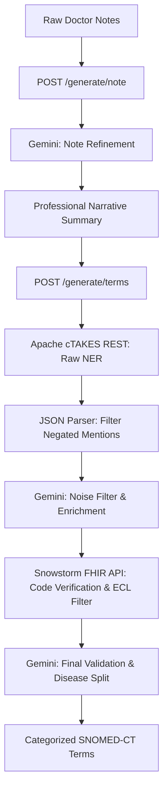

# 🚀 CTakes REST Service API

This directory contains the **FastAPI wrapper service** for the Apache cTAKES REST pipeline. It serves as an intelligent middleware layer that bridges clinical text inputs with LLM refinement (Google Gemini), Named Entity Recognition (cTAKES), and concept validation against a local SNOMED-CT database (Snowstorm).

---

## 🏗️ System Architecture & Data Flow

The API coordinates a multi-stage pipeline to process unstructured clinical text into high-fidelity, categorized SNOMED-CT terms:



### Pipeline Details:
1. **Clinical Note Refinement (`/generate/note`)**: Translates shorthand clinical notes and abbreviations (e.g., `DM` ➔ `Diabetes Mellitus`, `HPT` ➔ `Hypertension`, `od` ➔ `once daily`) into a formal clinical narrative summary.
2. **Named Entity Recognition (NER)**: Submits the refined narrative to an Apache cTAKES container to extract medical concepts (medications, procedures, symptoms, anatomical sites, diagnoses).
3. **Filtering & Enrichment**: Google Gemini filters out irrelevant mapping tags and enriches the results with any missing terms implied by the context.
4. **SNOMED-CT Concept Mapping**: Query terms are checked against the Snowstorm Lite FHIR expansion API (`/fhir/ValueSet/$expand`) using Expression Constraint Language (ECL) scopes to extract accurate codes and descriptions.
5. **Final Validation & Disease Split**: Categorizes diagnoses into `communicable_disease` and `non_communicable_disease`, discarding any contextually invalid mappings.

---

## ⚙️ Environment Variables & Configuration

Create a `.env` file in the project root directory (referenced by the API container) with the following environment variables:

| Variable | Description | Example / Default Value |
| :--- | :--- | :--- |
| `GOOGLE_APPLICATION_CREDENTIALS` | JSON service account key string for Vertex AI/Gemini access | `{"type": "service_account", ...}` |
| `GOOGLE_APPLICATION_SCOPES` | Cloud platform authorization scope | `https://www.googleapis.com/auth/cloud-platform` |
| `API_BEARER_TOKEN` | Raw authentication token string (used by client/tests) | `c73e3c54-b81b-45e9-ae05-8437e7ea3f2e` |
| `API_BEARER_TOKEN_HASH` | Bcrypt hash of the bearer token for security verification | `$2a$12$hknEgVoR.cfg.115lfneS...` |
| `SNOWSTORM_URL` | Base URL of the Snowstorm FHIR terminology server | `http://snowstorm-lite:8080` (or `http://localhost:8080`) |
| `SNOWSTORM_BRANCH` | Target branch of the SNOMED database | `MAIN` |
| `CTAKES_URL` | Endpoint of the Apache cTAKES REST service | `http://localhost:8083/ctakes-web-rest/service/analyze` |

---

## 🔒 Bearer Token Authentication & Hashing

For production deployments, the API secures all endpoints via a Bearer token verification check. You must generate a bcrypt hash of your chosen token and store it in `API_BEARER_TOKEN_HASH`. 

> [!NOTE]
> If `API_BEARER_TOKEN_HASH` is left empty or omitted, authentication checks will be skipped (only recommended for local debugging).

Use the following Python script to generate your token hash:

```python
import bcrypt

# The raw token clients must supply in the 'Authorization: Bearer <token>' header
raw_token = "my-secure-api-token"

# Generate bcrypt hash
hashed = bcrypt.hashpw(raw_token.encode('utf-8'), bcrypt.gensalt(rounds=12))
print("API_BEARER_TOKEN_HASH=" + hashed.decode('utf-8'))
```

---

## 🐳 End-to-End Container Deployment

To run the complete pipeline, all three services must share the same Docker network (`backend`).

### Step 1: Create the Docker Network
```bash
docker network create backend
```

### Step 2: Run Apache cTAKES Service
You can either build the cTAKES image from scratch or load it from a pre-saved tar file shared by teammates.

**Option A: Load from Pre-saved Tar File (Recommended if available)**
If you have a compressed image tarball (e.g., `ctakes-rest-service.tar.gz`), run:
```bash
gunzip ctakes-rest-service.tar.gz
docker load -i ctakes-rest-service.tar
```

**Option B: Build from Scratch**
If you do not have the tar file, build the image from the root of this repository (this compiles Maven dependencies and downloads large dictionaries):
```bash
# Run this from the repository root directory
docker build -t ctakes-rest-service .
```

Once loaded or built, start the container on the shared network mapping port `8083`:
```bash
docker run -d \
  --name ctakes-rest-service \
  --network backend \
  -p 8083:8080 \
  --memory=5g \
  --restart unless-stopped \
  ctakes-rest-service:latest
```

### Step 3: Run Snowstorm Lite & Onboard SNOMED-CT Dictionary
Snowstorm Lite is a lightweight, high-performance FHIR terminology server that runs self-contained (using Lucene) and does not require an external database like Elasticsearch. It has a very small memory footprint (typically under 1GB).

**1. Run Snowstorm Lite Container**
Run the container on the shared `backend` network, mapping port `8080`:
```bash
docker run -d \
  --name snowstorm-lite \
  --network backend \
  -p 8080:8080 \
  --restart unless-stopped \
  snomedinternational/snowstorm-lite:latest
```

**2. Onboard the SNOMED-CT RF2 Dictionary**
By default, the new Snowstorm Lite instance is empty. You must onboard your SNOMED-CT RF2 release archive (ZIP format) using the provided Python script:
```bash
# Run from the repository root
python scripts/snomed/snomed_rf_refresh.py \
  --archive-path /path/to/SnomedCT_RF2Release_INT_PRODUCTION.zip \
  --base-url http://localhost:8080
```
This script handles the onboarding process by:
1. Creating an import job via Snowstorm Lite's `POST /imports` endpoint.
2. Uploading the RF2 ZIP archive.
3. Polling the import status until it reports `COMPLETED`.

### Step 4: Deploy the FastAPI Wrapper API
You can build and deploy the API using the helper script `start.sh`:
```bash
chmod +x start.sh
./start.sh
```

Alternatively, run the manual Docker commands:
```bash
# Build the API image
docker build -t cne-api .

# Run the API container
docker run -d \
  --name cne-api-container \
  --network backend \
  -p 8082:8082 \
  --env-file ../.env \
  --restart unless-stopped \
  cne-api
```

---

## 📡 API Endpoints

### 1. Root & Health Checks

#### `GET /`
Verifies API connectivity. Requires bearer token if configured.
* **Response**: `{"message": "CTakes REST Service API"}`

#### `GET /health`
Internal service health status.
* **Response**: `{"status": "healthy"}`

#### `GET /generate/ctakes/health`
Simulates a test narrative through cTAKES and parses output to confirm that the full cTAKES execution pipeline is functional.
* **Response**:
  ```json
  {
    "status": "alive",
    "alive": true,
    "total_terms": 12,
    "terms": { ... },
    "tokens_used": { ... }
  }
  ```

---

### 2. Clinical Processing

#### `POST /generate/note`
Accepts raw doctor's notes and returns a refined, grammatically correct narrative paragraphs.
* **Request Body**:
  ```json
  {
    "text": "DM HPT currently: t losartan 100mg od t metformin 1g bd no active complaints"
  }
  ```
* **Response Body**:
  ```json
  {
    "text": "The patient has diabetes mellitus and hypertension. Currently, the patient is on Losartan 100mg once daily and Metformin 1g twice daily. The patient has no active complaints.",
    "tokens_used": {
      "generate_summary": { "input_token": 120, "output_token": 45 }
    }
  }
  ```

#### `POST /generate/terms`
The full processing pipeline: takes text, runs cTAKES, performs LLM filtering/enrichment, validates SNOMED-CT codes, and splits diagnoses.
* **Request Body**:
  ```json
  {
    "text": "The patient has diabetes mellitus and hypertension. Currently, the patient is on Losartan 100mg once daily and Metformin 1g twice daily."
  }
  ```
* **Response Body**:
  ```json
  {
    "terms": {
      "anatomical_sites": [],
      "procedures": [],
      "symptoms": [],
      "diagnosis": {
        "communicable_disease": [],
        "non_communicable_disease": [
          { "term": "Diabetes mellitus (disorder)", "code": "73211009" },
          { "term": "Hypertension (disorder)", "code": "38341003" }
        ]
      },
      "medications": [
        { "term": "Losartan (substance)", "code": "372687004" },
        { "term": "Metformin (substance)", "code": "372605001" }
      ]
    },
    "tokens_used": {
      "filter_tags": { "input_token": 450, "output_token": 180 },
      "validate_final_output": { "input_token": 310, "output_token": 95 }
    }
  }
  ```

---

## 🧪 Testing the API

A test suite is available under the `test/` directory to verify the health, auth, note-refinement, and term-generation endpoints.

1. Install testing dependencies:
   ```bash
   pip install requests python-dotenv
   ```
2. Navigate to the `test/` directory:
   ```bash
   cd test
   ```
3. Run tests using environment variables:
   ```bash
   API_BASE_URL=http://localhost:8082 API_BEARER_TOKEN=your-token-here python test_api.py
   ```
